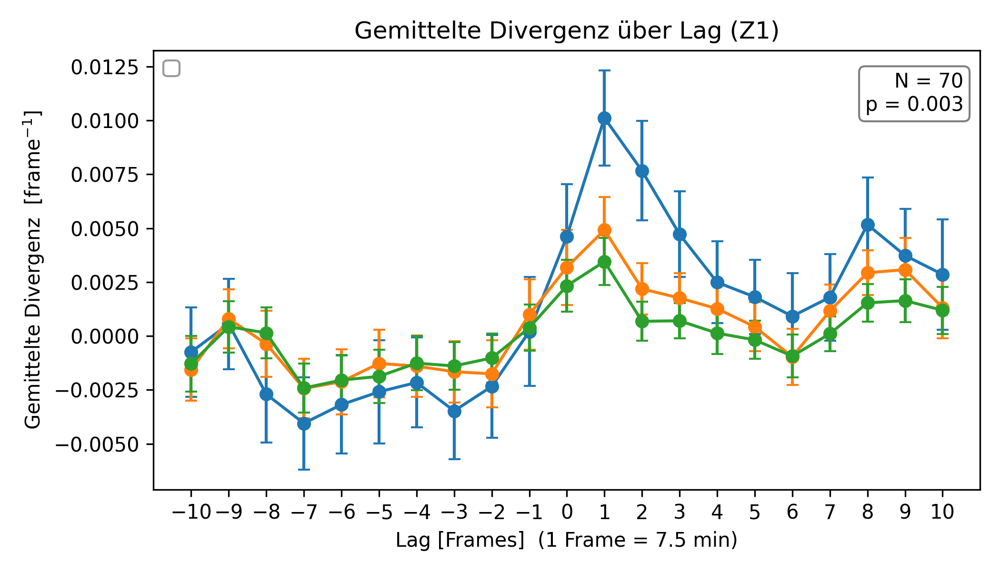

# Quantification & Modelling of Tissue Growth  
*CPU-based pipeline for mitosis detection & divergence analysis*

This repository contains all source code of the Bachelor’s thesis  
**“Quantification and Modelling of Tissue Growth”**  
(Heinrich Heine University Düsseldorf, 2025).

The goal is a **GPU-free** analysis pipeline that

1. detects mitosis events in brightfield time-lapse sequences using a compact **YOLOv5s** detector, and  
2. quantifies their mechanical neighbourhood via **dense optical-flow fields** (Farnebäck) turned into divergence/magnitude maps (*DefMaps*).

> **Quick summary**  
> – ~95 % mAP50 on the training level  
> – Significant divergence minima before and divergence maxima after mitosis events  

---

## Folders & files

| Path / file                      | Purpose |
|----------------------------------|---------|
| `build_defmap_stack.py`          | Builds divergence/magnitude stacks from optical-flow fields. |
| `confidence.py`                  | Computes adaptive confidence thresholds via KDE & ROC. |
| `heatmap.py`                     | Renders density heatmaps of mitosis positions. |
| `iou.py`                         | Helper functions for intersection-over-union matching along the z-axis. |
| `main_example_images.py`         | Minimal example to demo the pipeline on sample frames. |
| `match_labels.py`                | Links bounding boxes temporally & axially and assigns track IDs. |
| `rgbcode.py`                     | Stacks three z-layers into RGB tensor frames. |
| `timelagcorrection_div.py`       | Lag analysis: confidence ↔ divergence. |
| `timelagcorrection_mag.py`       | Lag analysis: confidence ↔ displacement magnitude. |

*(All scripts run standalone.)*

---

## Key plots

### 1. Mean divergence over lag

  

*Mean divergence in the vicinity of mitosis time points for different ROI scalings (Z₁).*

---

### 2. IoU distribution of matched bounding boxes

  

*IoU distribution of axially matched bounding boxes between z-layers (8-layer vs. 6-layer dataset).*

---

### 3. Spatial distribution of mitosis events

  

*Density heatmap of cell centers in the 6-layer dataset (Z₂ / Z₃), revealing distinct tissue regions.*

---

## Demo video

The repository includes a short example video that illustrates where mitosis events are detected:

- `assets/cell_division_detected.mp4` – **Mitosis detection:** visualization of the time-lapse sequence with YOLOv5s bounding boxes over detected cell divisions.

[▶ Watch mitosis detection](assets/cell_division_detected.mp4)
