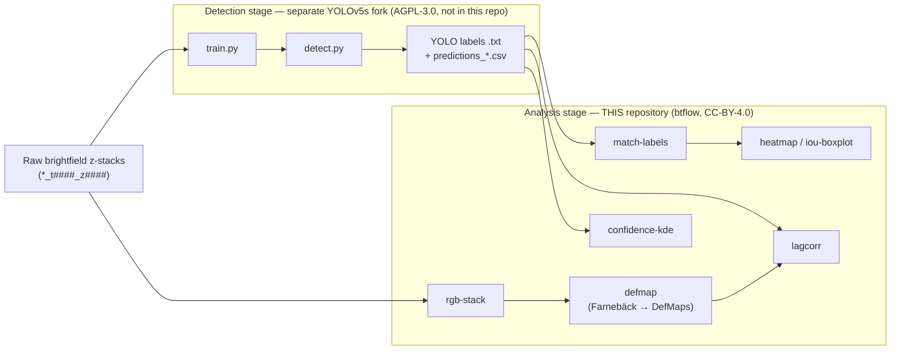
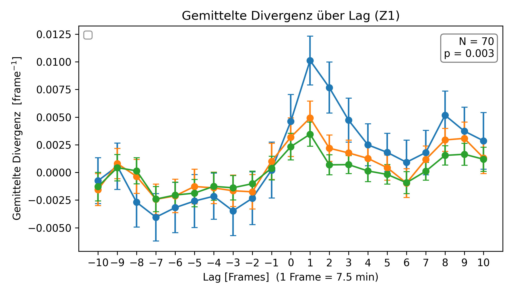
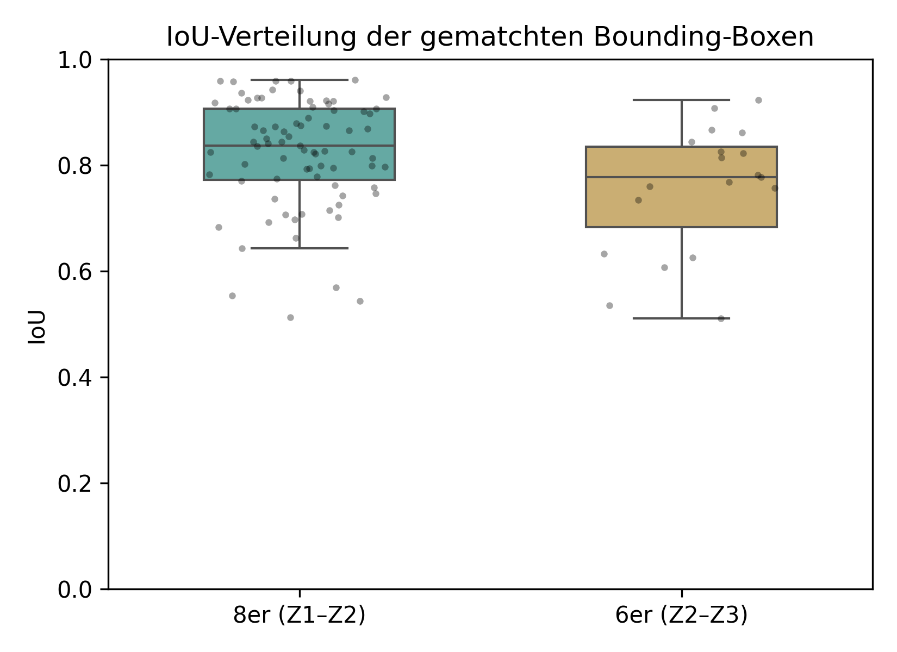
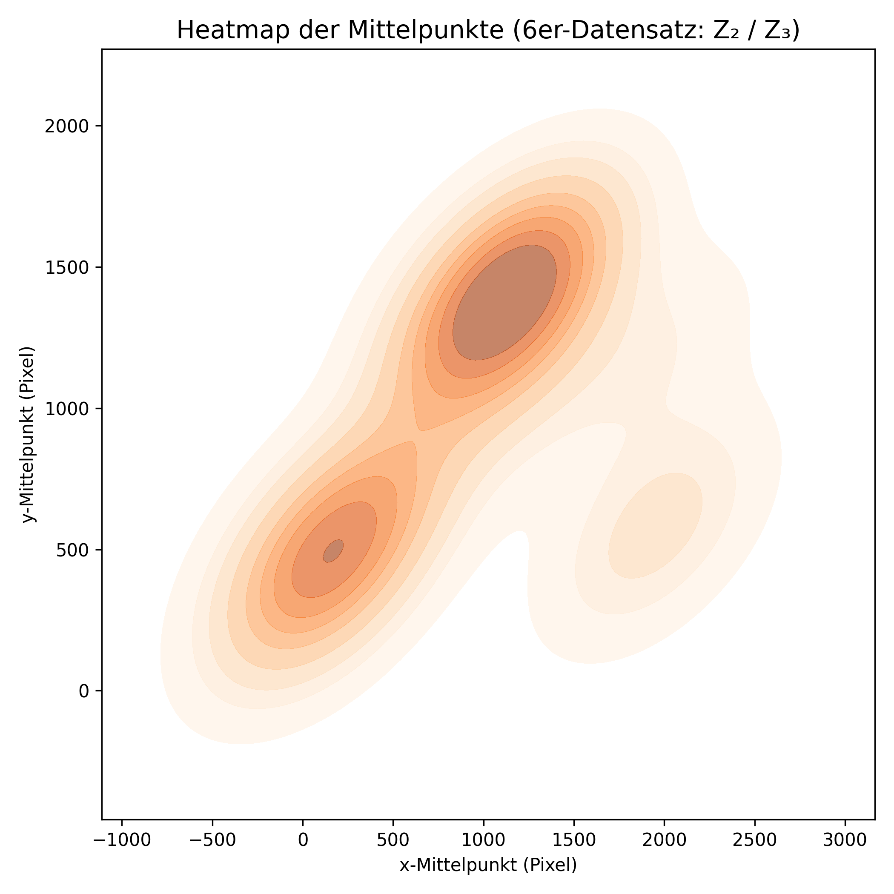

# bachelor-thesis-flow

*CPU-based optical-flow analysis of mitosis events — the analysis stage of the thesis pipeline*

[](https://github.com/rayanchatt/bachelor-thesis-flow/actions/workflows/ci.yml)
[](https://github.com/rayanchatt/bachelor-thesis-flow/actions/workflows/codeql.yml)
[](https://securityscorecards.dev/viewer/?uri=github.com/rayanchatt/bachelor-thesis-flow)
[](https://www.python.org/)
[](LICENSE)
[](https://github.com/astral-sh/ruff)
[](https://mypy-lang.org/)

Source code accompanying the Bachelor's thesis
**"Quantification and Modelling of Tissue Growth"**
(Heinrich Heine University Düsseldorf, Institut für Biomedizinische Physik, 2025).

The full thesis pipeline is **GPU-free** and runs in two stages:

1. **Detection** — a compact **YOLOv5s** detector locates mitosis events in
   brightfield time-lapse sequences.
2. **Analysis** — the mechanical neighbourhood of each event is quantified via
   **dense Farnebäck optical-flow** fields turned into divergence and magnitude
   maps (*DefMaps*) and correlated against detector confidence.

> [!IMPORTANT]
> **This repository implements stage 2 (analysis) only.** The YOLOv5s detector
> is a separate component (a fork of [Ultralytics YOLOv5](https://github.com/ultralytics/yolov5)
> under the **AGPL-3.0** licence) and is intentionally kept out of this
> CC-BY-4.0 repository for licence compatibility. The tools here consume the
> detector's outputs — YOLO `.txt` label files and `predictions_*.csv`. See
> [Pipeline scope](#pipeline-scope) for the full data flow.

> **Quick summary**
> – ~95 % mAP<sub>50</sub> for the detector on the 5-layer dataset
> – Significant divergence minima before and divergence maxima after mitosis events

---

## Pipeline scope


```mermaid
flowchart LR
    A["Raw brightfield z-stacks<br/>(*_t####_z####)"]

    subgraph DET["Detection stage — separate YOLOv5s fork (AGPL-3.0, not in this repo)"]
        B["train.py"] --> C["detect.py"]
        C --> D["YOLO labels .txt<br/>+ predictions_*.csv"]
    end

    subgraph ANA["Analysis stage — THIS repository (btflow, CC-BY-4.0)"]
        E["rgb-stack"] --> F["defmap<br/>(Farnebäck → DefMaps)"]
        G["match-labels"]
        H["lagcorr"]
        I["heatmap / iou-boxplot"]
        J["confidence-kde"]
    end

    A --> B
    A --> E
    D --> G
    D --> H
    D --> J
    F --> H
    G --> I
```

**What this repository does not include.** Model training, trained weights, and
inference all live in the detection fork. The `btflow rgb-stack` and
`btflow defmap` commands operate directly on raw frames and need nothing from
the detector; `btflow match-labels`, `lagcorr`, and `confidence-kde` require the
detector's `.txt`/`.csv` outputs as input.

---

## Install

```bash
pip install -e ".[dev]"
```

The package targets **Python ≥ 3.11** and exposes a single console
entry point `btflow` with subcommands.

```bash
btflow --help
```

## Usage

| Subcommand        | Purpose                                                         |
|-------------------|-----------------------------------------------------------------|
| `btflow rgb-stack`       | Merge per-z grayscale frames into RGB frames.            |
| `btflow defmap`          | Build divergence/magnitude DefMap stacks (Farnebäck).     |
| `btflow match-labels`    | Link YOLO detections from two z-layers by IoU.            |
| `btflow lagcorr`         | Lag correlation between YOLO confidence and DefMaps.      |
| `btflow confidence-kde`  | KDE plot of YOLO confidence grouped by z-layer.           |
| `btflow heatmap`         | 2D KDE heatmap of bounding-box centers.                   |
| `btflow iou-boxplot`     | IoU boxplot across one or more matched-box CSVs.          |

Each subcommand exposes `--help` with the full argument list.

Example: build divergence DefMap stacks from a folder of raw frames.

```bash
btflow defmap \
  --rgb-dir  path/to/raw_frames \
  --out-dir  path/to/output \
  --metric   div \
  --sigma    1.5
```

## Key plots

### 1. Mean divergence over lag

<p align="center">
  
</p>

Mean divergence in the vicinity of mitosis time points for different ROI scalings (Z₁).

### 2. IoU distribution of matched bounding boxes

<p align="center">
  
</p>

IoU distribution of axially matched bounding boxes between z-layers (8-layer vs. 6-layer dataset).

### 3. Spatial distribution of mitosis events

<p align="center">
  
</p>

Density heatmap of cell centers in the 6-layer dataset (Z₂ / Z₃), revealing distinct tissue regions.

## Demo video

A short example video illustrating where mitosis events are detected:

- `assets/cell_division_detected.mp4` — **Mitosis detection** visualisation of the time-lapse sequence with YOLOv5s bounding boxes over detected cell divisions. *(Produced by the separate detection stage; included here for illustration.)*

[▶ Watch mitosis detection](assets/cell_division_detected.mp4)

## Development

```bash
make install    # editable install + dev tools + pre-commit hooks
make lint       # ruff
make typecheck  # mypy --strict
make test       # pytest
make cov        # pytest with coverage
make figures    # regenerate synthetic sample plots under assets/synthetic/
```

Commits **must** follow [Conventional Commits](https://www.conventionalcommits.org/);
release-please uses the commit log to generate `CHANGELOG.md` and the next version tag.

## Citing

If you use this code, please cite it via the metadata in
[`CITATION.cff`](CITATION.cff) (GitHub renders a "Cite this repository"
button in the right-hand sidebar).

This software supports the Bachelor's thesis:

> Rayan Chatt. *Quantification and Modelling of Tissue Growth*
> (orig. *Quantifizierung und Modellierung von Gewebewachstum*).
> Bachelor's thesis, Heinrich Heine University Düsseldorf,
> Institut für Biomedizinische Physik, 2025.

A citable DOI for the software will be minted via Zenodo once the repository is
connected to a Zenodo archive (pending).

## License

Released under the [Creative Commons Attribution 4.0 International (CC-BY-4.0)](LICENSE) license.
